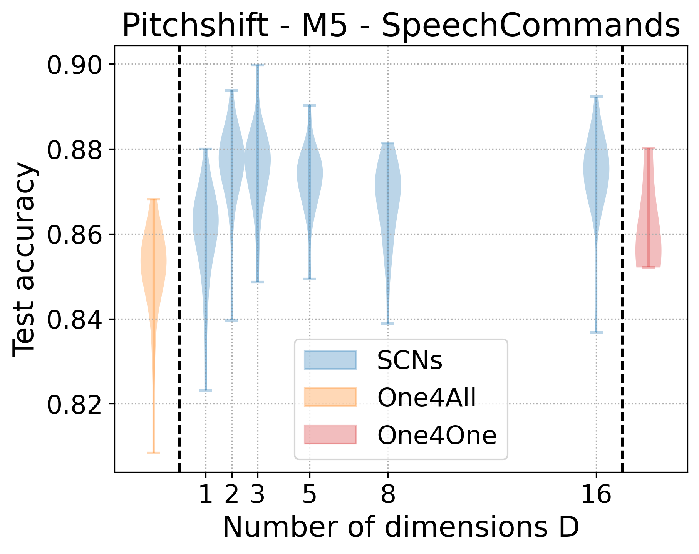
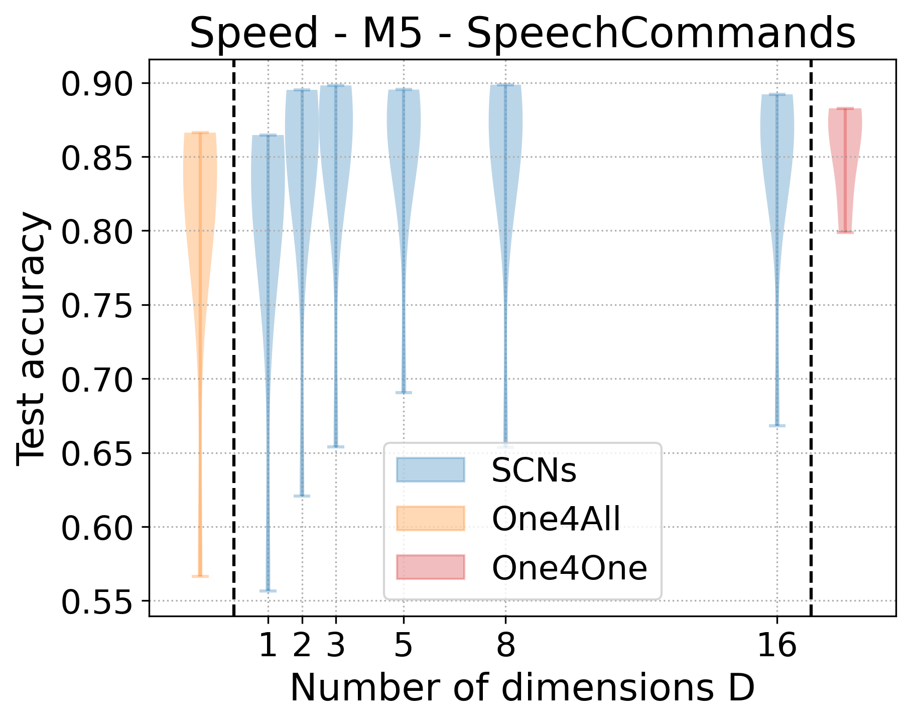

# SCN on audio transformations

We applied pitchshift and speed changes on the [SpeechCommands](https://www.tensorflow.org/datasets/catalog/speech_commands) dataste.


## Setup environment


### Environment requirments

- 3 GB space of disk, including 2.8 GB for dataset.
- 12 GB GPU Memory 
- Conda

### Install required packages

```
conda create -n audio_scn python=3.9
conda activate audico_scn
conda install pytorch==2.0.0 torchvision==0.15.1 torchaudio==2.0.1 pytorch-cuda=11.7 -c pytorch -c nvidia
conda install numpy matplotlib == 3.3.2 tqdm
```


## Train and evaluate models

### SCN

``` Shell
python audio_hhn.py --transform=speed --batchsize=256 --epochs=100 --output=./output --gpus=0 --dimensions=3

```

`transform` can be `pitchshift` or `speed`

### one4one


``` Shell
python audio_one4one.py --transform=speed --batchsize=256 --epochs=100 --output=./output --gpus=0
```

`transform` can be `pitchshift` or `speed`


### one4all


``` Shell
python audio_one4all.py --transform=speed --batchsize=256 --epochs=100 --output=./output --gpus=0
```

`transform` can be `pitchshift` or `speed`

## Compare the performance

In case you do not change the default `output` path, you can run the following one to get two plots for test accuracy.

``` Shell
python audio_acc_plot.py
```




