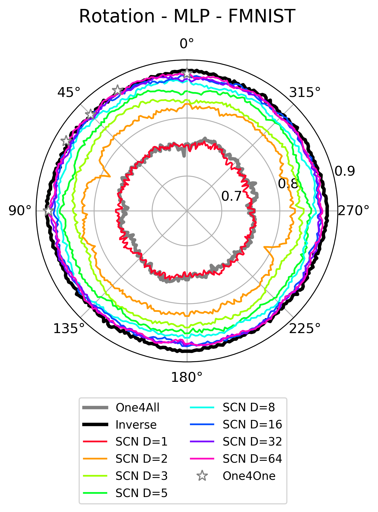
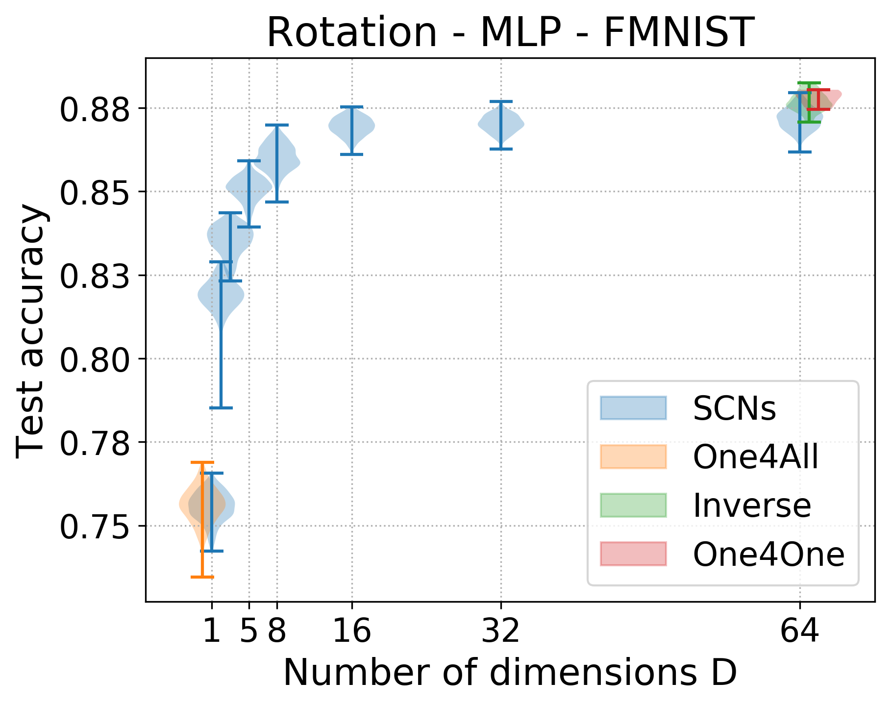
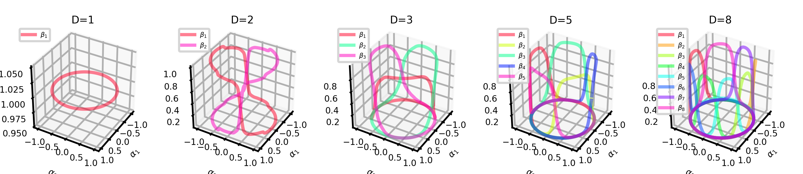

# subspace-configurable-networks

This is the code to train SCN models and all baselines for the 2D transformations used in the paper. We used Python 3.7.7

Install dependencies:
```
pip install -r requirements.txt
```

Run from the command line (also see `run.sh`) to train a SCN, D=3 for rotation for MLP inference network architecture on FMNIST with parameters as specified in the example.
```
CUDA_VISIBLE_DEVICES=0 \
python rotation_hhn.py \
	--arch=hhnmlpb \
	--dataset=FashionMNIST \
	--batchsize=64 \
	--epochs=500 \
	--learning_rate=0.001 \
	--output=output \
	--nlayers=1 \
	--width=32 \
	--dimensions=3
```

Replace `output` with the path to the output folder.

To run the code to train the baselines (One4All, Inverse and One4One), the specified network architecture should be `mlpb`. The other parameter values are kept the same.

```
CUDA_VISIBLE_DEVICES=0 \
python rotation_inverse.py \
	--arch=mlpb \
	--dataset=FashionMNIST \
	--batchsize=64 \
	--epochs=500 \
	--learning_rate=0.001 \
	--output=output \
	--nlayers=1 \
	--width=32
```

Sample trained models and computed statistics are provided in the `output` folder part of this repository. The folder structure is straightforwards with folder names including the architecture, the dataset, number of layers, network widths and the number of dimensions $D$.

You can use a sample plotting script to generate visualizations also presented in the paper:
```
python rotation_plot.py
```
Sample output is stores in the `figs` folder and is sorted by the transformation applied. We provide sample generated images visualizing the accuracy of SCNs for 2D rotation.



 

